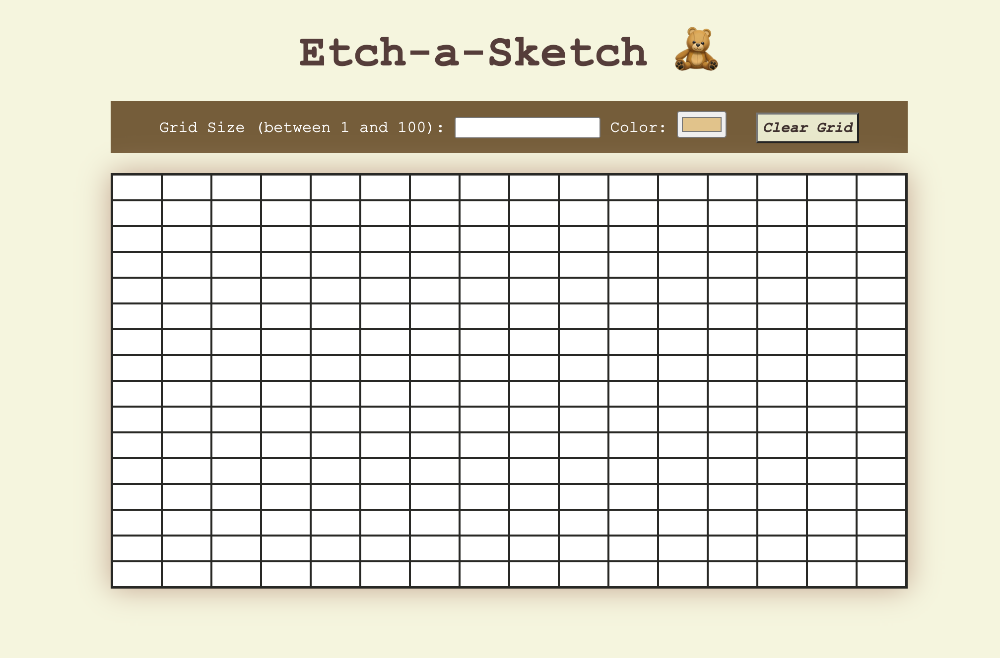

# Etch-a-Sketch

Click [Here](https://dvelazq1.github.io/etch-a-sketch/) to view the project website

This is a website inspired by the popular Etch-a-Sketch toy. This means it allows users to draw freely on the provided grid. It also allows for users to select which color they want to draw in as well as what size grid they want to draw on. The grid can be as 1x1 (just one cell) or as large as 100x100 depending on user input. There is also an option to clear the entire grid with the click of a button. 

Below is a screenshot of this project.

